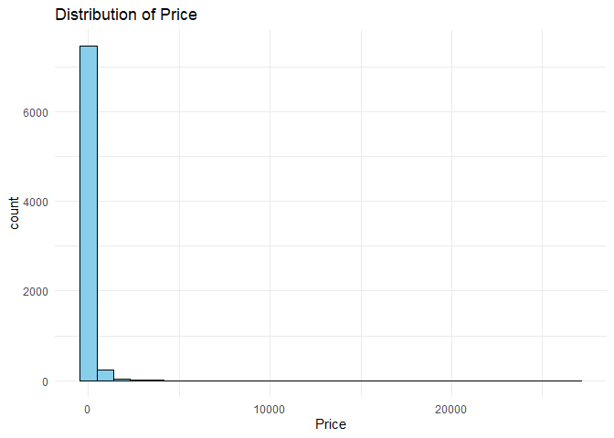
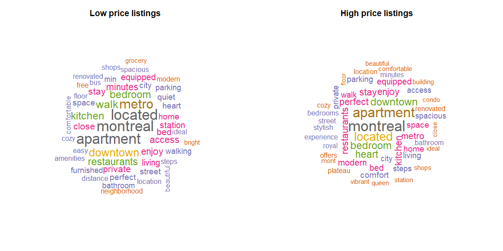
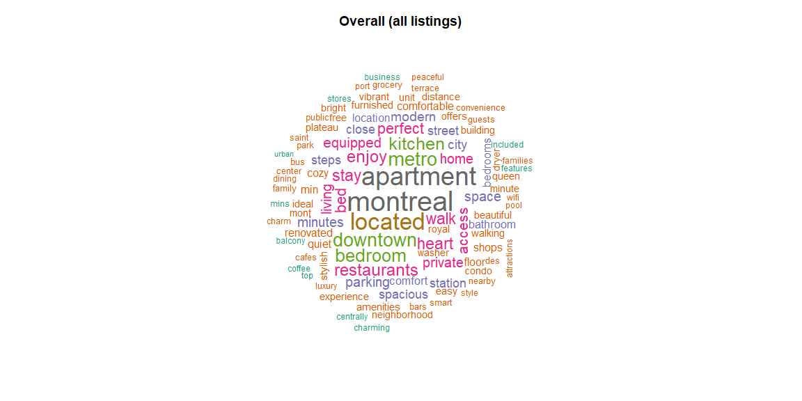
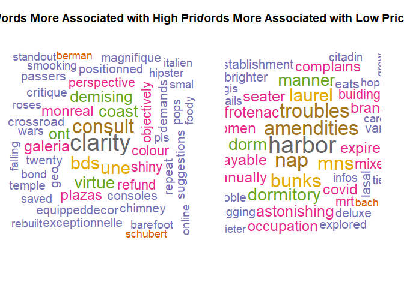
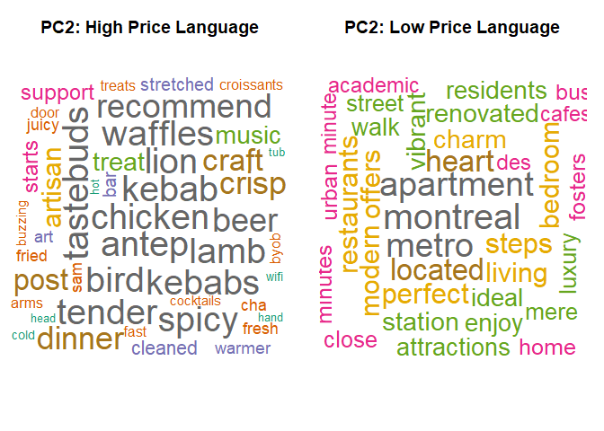

Factors on Airbnb Pricing
================
Priestly

# Airbnb Price Analysis (Montreal Listings)

## 1) Setup

## 2) Load Data

## Data Cleaning and Feature Preparation

### - Select variables + fix data types

### - Flag data quality issues (removal reasons)

### - Create final cleaned dataset

## Exploratory Data Analysis

### - Summary statistics

### - Price distribution

### - Why log(price) is used

## Text Analysis of Listing Descriptions

### - Create high/low price groups

### - Tokenize and remove stopwords

### - Wordclouds (high vs low)

### - Build Airbnb-specific stopword list

### - TF–IDF and group comparison

## Dimension Reduction on Descriptions (PCA on TF–IDF)

### - Document-term matrix (TF–IDF)

### - PCA (irlba) for large sparse text features

### - PCA interpretation via loadings wordclouds

## Statistical Modeling

### - Candidate models (AIC comparison)

### - Interaction test (ANOVA + AIC)

### - Final model summary

``` r
library(readr)
library(tidyverse)
library(dplyr)


Listings <- read_csv("C:/Users/pries/OneDrive/Documents/listings.csv",
                 show_col_types = FALSE)

glimpse(Listings)
```

    ## Rows: 9,550
    ## Columns: 79
    ## $ id                                           <dbl> 29059, 29061, 38118, 5047…
    ## $ listing_url                                  <chr> "https://www.airbnb.com/r…
    ## $ scrape_id                                    <dbl> 2.02509e+13, 2.02509e+13,…
    ## $ last_scraped                                 <chr> "9/18/2025", "9/18/2025",…
    ## $ source                                       <chr> "city scrape", "city scra…
    ## $ name                                         <chr> "Lovely studio Quartier L…
    ## $ description                                  <chr> "CITQ 267153<br />Lovely …
    ## $ neighborhood_overview                        <chr> "CENTRAL is the watchword…
    ## $ picture_url                                  <chr> "https://a0.muscache.com/…
    ## $ host_id                                      <dbl> 125031, 125031, 163569, 2…
    ## $ host_url                                     <chr> "https://www.airbnb.com/u…
    ## $ host_name                                    <chr> "Maryline", "Maryline", "…
    ## $ host_since                                   <chr> "5/14/2010", "5/14/2010",…
    ## $ host_location                                <chr> "Montreal, Canada", "Mont…
    ## $ host_about                                   <chr> "Voyageuse dans l'âme j'a…
    ## $ host_response_time                           <chr> "within an hour", "within…
    ## $ host_response_rate                           <chr> "100%", "100%", "0%", "10…
    ## $ host_acceptance_rate                         <chr> "100%", "100%", "0%", "10…
    ## $ host_is_superhost                            <lgl> TRUE, TRUE, FALSE, TRUE, …
    ## $ host_thumbnail_url                           <chr> "https://a0.muscache.com/…
    ## $ host_picture_url                             <chr> "https://a0.muscache.com/…
    ## $ host_neighbourhood                           <chr> "Downtown Montreal", "Dow…
    ## $ host_listings_count                          <dbl> 2, 2, 3, 2, 4, 2, 3, 1, 7…
    ## $ host_total_listings_count                    <dbl> 2, 2, 3, 3, 126, 4, 8, 1,…
    ## $ host_verifications                           <chr> "['email', 'phone', 'work…
    ## $ host_has_profile_pic                         <lgl> TRUE, TRUE, TRUE, TRUE, T…
    ## $ host_identity_verified                       <lgl> TRUE, TRUE, TRUE, TRUE, T…
    ## $ neighbourhood                                <chr> "Neighborhood highlights"…
    ## $ neighbourhood_cleansed                       <chr> "Ville-Marie", "Ville-Mar…
    ## $ neighbourhood_group_cleansed                 <lgl> NA, NA, NA, NA, NA, NA, N…
    ## $ latitude                                     <dbl> 45.51939, 45.51929, 45.52…
    ## $ longitude                                    <dbl> -73.56482, -73.56493, -73…
    ## $ property_type                                <chr> "Entire rental unit", "En…
    ## $ room_type                                    <chr> "Entire home/apt", "Entir…
    ## $ accommodates                                 <dbl> 4, 4, 1, 3, 4, 2, 4, 6, 3…
    ## $ bathrooms                                    <dbl> 1.0, 1.0, 1.0, 1.0, 1.0, …
    ## $ bathrooms_text                               <chr> "1 bath", "1 bath", "1 sh…
    ## $ bedrooms                                     <dbl> 1, 2, 3, 2, 1, 1, 1, 3, 1…
    ## $ beds                                         <dbl> 3, 2, 4, 4, 1, 1, 2, 3, N…
    ## $ amenities                                    <chr> "[\"TV with standard cabl…
    ## $ price                                        <chr> "$134.00", "$253.00", "$4…
    ## $ minimum_nights                               <dbl> 31, 2, 31, 3, 31, 32, 31,…
    ## $ maximum_nights                               <dbl> 60, 21, 60, 28, 90, 365, …
    ## $ minimum_minimum_nights                       <dbl> 1, 1, 31, 2, 1, 32, 31, 3…
    ## $ maximum_minimum_nights                       <dbl> 2, 2, 31, 3, 31, 32, 31, …
    ## $ minimum_maximum_nights                       <dbl> 1125, 21, 60, 1125, 1125,…
    ## $ maximum_maximum_nights                       <dbl> 1125, 21, 60, 1125, 1125,…
    ## $ minimum_nights_avg_ntm                       <dbl> 2.0, 2.0, 31.0, 3.0, 5.7,…
    ## $ maximum_nights_avg_ntm                       <dbl> 1125, 21, 60, 1125, 1125,…
    ## $ calendar_updated                             <lgl> NA, NA, NA, NA, NA, NA, N…
    ## $ has_availability                             <lgl> TRUE, TRUE, TRUE, TRUE, T…
    ## $ availability_30                              <dbl> 7, 6, 18, 3, 0, 0, 0, 0, …
    ## $ availability_60                              <dbl> 21, 31, 37, 7, 0, 13, 0, …
    ## $ availability_90                              <dbl> 48, 61, 47, 29, 19, 43, 0…
    ## $ availability_365                             <dbl> 312, 332, 322, 29, 38, 31…
    ## $ calendar_last_scraped                        <chr> "9/18/2025", "9/18/2025",…
    ## $ number_of_reviews                            <dbl> 499, 168, 17, 349, 588, 4…
    ## $ number_of_reviews_ltm                        <dbl> 31, 20, 0, 56, 84, 4, 0, …
    ## $ number_of_reviews_l30d                       <dbl> 2, 2, 0, 5, 5, 1, 0, 2, 0…
    ## $ availability_eoy                             <dbl> 61, 76, 62, 29, 34, 58, 1…
    ## $ number_of_reviews_ly                         <dbl> 33, 24, 1, 63, 82, 5, 0, …
    ## $ estimated_occupancy_l365d                    <dbl> 255, 120, 0, 255, 255, 25…
    ## $ estimated_revenue_l365d                      <dbl> 34170, 30360, 0, 39780, 3…
    ## $ first_review                                 <chr> "6/20/2010", "2/23/2012",…
    ## $ last_review                                  <chr> "9/1/2025", "9/2/2025", "…
    ## $ review_scores_rating                         <dbl> 4.69, 4.77, 4.53, 4.96, 4…
    ## $ review_scores_accuracy                       <dbl> 4.79, 4.85, 4.53, 4.96, 4…
    ## $ review_scores_cleanliness                    <dbl> 4.64, 4.69, 4.24, 4.95, 4…
    ## $ review_scores_checkin                        <dbl> 4.82, 4.88, 4.82, 4.96, 4…
    ## $ review_scores_communication                  <dbl> 4.79, 4.84, 4.82, 4.99, 4…
    ## $ review_scores_location                       <dbl> 4.82, 4.87, 4.65, 4.84, 4…
    ## $ review_scores_value                          <dbl> 4.68, 4.72, 4.41, 4.92, 4…
    ## $ license                                      <chr> "Quebec - Registration nu…
    ## $ instant_bookable                             <lgl> FALSE, FALSE, FALSE, TRUE…
    ## $ calculated_host_listings_count               <dbl> 2, 2, 3, 2, 4, 2, 2, 1, 7…
    ## $ calculated_host_listings_count_entire_homes  <dbl> 2, 2, 0, 1, 4, 2, 2, 1, 7…
    ## $ calculated_host_listings_count_private_rooms <dbl> 0, 0, 3, 1, 0, 0, 0, 0, 0…
    ## $ calculated_host_listings_count_shared_rooms  <dbl> 0, 0, 0, 0, 0, 0, 0, 0, 0…
    ## $ reviews_per_month                            <dbl> 2.69, 1.02, 0.10, 1.92, 3…

``` r
dim(Listings)
```

    ## [1] 9550   79

``` r
head(Listings, 15)
```

    ## # A tibble: 15 × 79
    ##        id listing_url            scrape_id last_scraped source name  description
    ##     <dbl> <chr>                      <dbl> <chr>        <chr>  <chr> <chr>      
    ##  1  29059 https://www.airbnb.co…   2.03e13 9/18/2025    city … Love… CITQ 26715…
    ##  2  29061 https://www.airbnb.co…   2.03e13 9/18/2025    city … Mais… Lovely his…
    ##  3  38118 https://www.airbnb.co…   2.03e13 9/18/2025    city … Beau… Nearest me…
    ##  4  50479 https://www.airbnb.co…   2.03e13 9/18/2025    city … L'Ar… The appart…
    ##  5  66247 https://www.airbnb.co…   2.03e13 9/18/2025    city … Mode… Located in…
    ##  6  66276 https://www.airbnb.co…   2.03e13 9/18/2025    city … Urba… Escape the…
    ##  7  70489 https://www.airbnb.co…   2.03e13 9/18/2025    city … Ultr… Ultra Luxu…
    ##  8  70801 https://www.airbnb.co…   2.03e13 9/18/2025    city … Larg… Enr. CITQ:…
    ##  9  85267 https://www.airbnb.co…   2.03e13 9/18/2025    previ… Coun… <NA>       
    ## 10  99859 https://www.airbnb.co…   2.03e13 9/18/2025    city … Plat… <NA>       
    ## 11 103128 https://www.airbnb.co…   2.03e13 9/18/2025    city … Fami… <NA>       
    ## 12 135275 https://www.airbnb.co…   2.03e13 9/18/2025    city … Char… This charm…
    ## 13 137443 https://www.airbnb.co…   2.03e13 9/18/2025    city … Apt … Sunny, spa…
    ## 14 142722 https://www.airbnb.co…   2.03e13 9/18/2025    city … Char… <NA>       
    ## 15 160600 https://www.airbnb.co…   2.03e13 9/18/2025    city … Spac… Escape to …
    ## # ℹ 72 more variables: neighborhood_overview <chr>, picture_url <chr>,
    ## #   host_id <dbl>, host_url <chr>, host_name <chr>, host_since <chr>,
    ## #   host_location <chr>, host_about <chr>, host_response_time <chr>,
    ## #   host_response_rate <chr>, host_acceptance_rate <chr>,
    ## #   host_is_superhost <lgl>, host_thumbnail_url <chr>, host_picture_url <chr>,
    ## #   host_neighbourhood <chr>, host_listings_count <dbl>,
    ## #   host_total_listings_count <dbl>, host_verifications <chr>, …

\###Data Cleaning Strategy

To prepare the Airbnb dataset for analysis, I applied a systematic
rule-based cleaning process using a checklist of common data issues.
Each listing was evaluated and tagged with specific removal reasons so
that the impact of filtering could be summarized transparently.

Cleaning checks performed The following issues were examined:

-Missing or invalid values: listings with missing, zero, or negative
prices, or missing key predictors (accommodates, bedrooms,
minimum_nights, room_type).

-Incorrect data types: prices and percentage variables were converted
from text to numeric format, and categorical variables were converted to
factors.

-Logical inconsistencies: listings with unrealistic combinations (e.g.,
0 bedrooms but large accommodation capacity) were flagged.

-Extreme outliers: the top 1% of prices were treated as outliers to
prevent a small number of luxury listings from dominating statistical
models.

Justification: These steps ensure that the final dataset contains valid,
comparable listings and improves the reliability of regression analysis
by reducing missing data problems, data-entry errors, and extreme
leverage points.

Transparency: Rather than filtering immediately, each rule creates a
“reason” flag. A summary table reports how many observations were
removed for each reason, making the cleaning process reproducible and
transparent.

``` r
library(dplyr)
library(readr)
library(stringr)

clean0 <- Listings %>%
  transmute(
    id = as.character(id),
    price_raw = price,
    price = parse_number(price),

    host_response_rate = parse_number(host_response_rate)/100,
    host_acceptance_rate = parse_number(host_acceptance_rate)/100,
    host_listings_count = as.numeric(host_listings_count),

    property_type = as.factor(property_type),
    room_type = as.factor(room_type),

    accommodates = as.numeric(accommodates),
    bathrooms = as.numeric(bathrooms),
    bedrooms = as.numeric(bedrooms),
    beds = as.numeric(beds),

    minimum_nights = as.numeric(minimum_nights),
    maximum_nights = as.numeric(maximum_nights),

    description = description
  )
```

``` r
clean1 <- clean0 %>%
  mutate(
    reason_price_missing = is.na(price) | price <= 0,
    reason_min_nights_missing = is.na(minimum_nights),
    reason_room_type_missing = is.na(room_type),
    reason_bedrooms_missing = is.na(bedrooms),
    reason_accommodates_missing = is.na(accommodates),

    #logical inconsistency:
    reason_inconsistent_capacity = !is.na(bedrooms) & !is.na(accommodates) &
      bedrooms == 0 & accommodates >= 1,
      log_price = log1p(price),
  )
```

``` r
# Summarize removal reasons
removal_summary <- clean1 %>%
  summarise(
    total_rows = n(),
    removed_price_missing = sum(reason_price_missing, na.rm=TRUE),
    removed_min_nights_missing = sum(reason_min_nights_missing, na.rm=TRUE),
    removed_room_type_missing = sum(reason_room_type_missing, na.rm=TRUE),
    removed_bedrooms_missing = sum(reason_bedrooms_missing, na.rm=TRUE),
    removed_accommodates_missing = sum(reason_accommodates_missing, na.rm=TRUE),
    removed_inconsistent_capacity = sum(reason_inconsistent_capacity, na.rm=TRUE)
  )

removal_summary
```

    ## # A tibble: 1 × 7
    ##   total_rows removed_price_missing removed_min_nights_m…¹ removed_room_type_mi…²
    ##        <int>                 <int>                  <int>                  <int>
    ## 1       9550                  1067                      0                      0
    ## # ℹ abbreviated names: ¹​removed_min_nights_missing, ²​removed_room_type_missing
    ## # ℹ 3 more variables: removed_bedrooms_missing <int>,
    ## #   removed_accommodates_missing <int>, removed_inconsistent_capacity <int>

### Produce the final cleaned dataset + show % removed

``` r
sub <- clean1 %>%
  filter(
    !reason_price_missing,
    !reason_min_nights_missing,
    !reason_room_type_missing,
    !reason_bedrooms_missing,
    !reason_accommodates_missing,
    !reason_inconsistent_capacity
  ) 

cat("Rows before:", nrow(clean1), "\n")
```

    ## Rows before: 9550

``` r
cat("Rows after :", nrow(sub), "\n")
```

    ## Rows after : 7748

``` r
cat("Percent kept:", round(100*nrow(sub)/nrow(clean1), 1), "%\n")
```

    ## Percent kept: 81.1 %

``` r
glimpse(sub)
```

    ## Rows: 7,748
    ## Columns: 22
    ## $ id                           <chr> "29059", "29061", "38118", "50479", "6624…
    ## $ price_raw                    <chr> "$134.00", "$253.00", "$47.00", "$156.00"…
    ## $ price                        <dbl> 134, 253, 47, 156, 146, 57, 90, 386, 233,…
    ## $ host_response_rate           <dbl> 1.00, 1.00, 0.00, 1.00, 0.96, 1.00, 1.00,…
    ## $ host_acceptance_rate         <dbl> 1.00, 1.00, 0.00, 1.00, 0.99, 1.00, 0.94,…
    ## $ host_listings_count          <dbl> 2, 2, 3, 2, 4, 2, 3, 1, 1, 1, 3, 1, 2, 8,…
    ## $ property_type                <fct> Entire rental unit, Entire home, Private …
    ## $ room_type                    <fct> Entire home/apt, Entire home/apt, Private…
    ## $ accommodates                 <dbl> 4, 4, 1, 3, 4, 2, 4, 6, 4, 7, 2, 5, 4, 2,…
    ## $ bathrooms                    <dbl> 1.0, 1.0, 1.0, 1.0, 1.0, 1.0, 1.5, 2.5, 1…
    ## $ bedrooms                     <dbl> 1, 2, 3, 2, 1, 1, 1, 3, 2, 4, 1, 2, 2, 1,…
    ## $ beds                         <dbl> 3, 2, 4, 4, 1, 1, 2, 3, 3, 4, 1, 2, 3, 1,…
    ## $ minimum_nights               <dbl> 31, 2, 31, 3, 31, 32, 31, 32, 31, 5, 31, …
    ## $ maximum_nights               <dbl> 60, 21, 60, 28, 90, 365, 365, 96, 364, 14…
    ## $ description                  <chr> "CITQ 267153<br />Lovely studio with 1 cl…
    ## $ reason_price_missing         <lgl> FALSE, FALSE, FALSE, FALSE, FALSE, FALSE,…
    ## $ reason_min_nights_missing    <lgl> FALSE, FALSE, FALSE, FALSE, FALSE, FALSE,…
    ## $ reason_room_type_missing     <lgl> FALSE, FALSE, FALSE, FALSE, FALSE, FALSE,…
    ## $ reason_bedrooms_missing      <lgl> FALSE, FALSE, FALSE, FALSE, FALSE, FALSE,…
    ## $ reason_accommodates_missing  <lgl> FALSE, FALSE, FALSE, FALSE, FALSE, FALSE,…
    ## $ reason_inconsistent_capacity <lgl> FALSE, FALSE, FALSE, FALSE, FALSE, FALSE,…
    ## $ log_price                    <dbl> 4.905275, 5.537334, 3.871201, 5.056246, 4…

## Exploratory Data Analysis:

## Numeric summaries

``` r
library(scales)

sub %>%
  summarise(
    price_min = min(price, na.rm=TRUE),
    price_med = median(price, na.rm=TRUE),
    price_mean = mean(price, na.rm=TRUE),
    price_max = max(price, na.rm=TRUE)
  )
```

    ## # A tibble: 1 × 4
    ##   price_min price_med price_mean price_max
    ##       <dbl>     <dbl>      <dbl>     <dbl>
    ## 1        12       129       185.     26724

### Plot Of price

``` r
library(ggplot2)

ggplot(sub, aes(price)) +
  geom_histogram(bins = 40) +
  scale_x_continuous(labels = dollar_format()) +
  labs(
    title = "Distribution of Airbnb Prices (Cleaned Data)",
    x = "Price (CAD)",
    y = "Number of listings"
  ) +
  theme_minimal(base_size = 12)
```

<!-- -->

## Visualizing Why Used Log of Price Instead of Price

``` r
library(ggplot2)

# Original price
ggplot(sub, aes(x = price)) +
  geom_histogram(fill = "skyblue", color = "black", bins = 30) +
  ggtitle("Distribution of Price") +
  xlab("Price") +
  theme_minimal()
```

<!-- -->

``` r
# Log-transformed price
ggplot(sub, aes(x = log_price)) +
  geom_histogram(fill = "lightgreen", color = "black", bins = 30) +
  ggtitle("Distribution of Log(Price)") +
  xlab("Log(Price)") +
  theme_minimal()
```

<!-- -->

``` r
library(dplyr)
library(stringr)
library(tidytext)
library(wordcloud)
library(RColorBrewer)

# 1) Build grouped text data
text_df <- sub %>%
  filter(!is.na(description), !is.na(price)) %>%
  mutate(price_group = if_else(price >= median(price, na.rm = TRUE),
                               "High price", "Low price")) %>%
  select(id, price_group, description)

# Tokenize + remove stopwords + keep sensible tokens
words <- text_df %>%
  unnest_tokens(word, description) %>%
  anti_join(stop_words, by = "word") %>%
  filter(str_detect(word, "^[a-z]+$"), nchar(word) > 2)

word_counts <- words %>%
  count(price_group, word, sort = TRUE)

top_high <- word_counts %>%
  filter(price_group == "High price") %>%
  slice_max(n, n = 50)

top_low <- word_counts %>%
  filter(price_group == "Low price") %>%
  slice_max(n, n = 50)

# Wordcloud visualization (side-by-side comparison)
par(mfrow = c(1, 2), mar = c(1, 1, 3, 1))
wordcloud(words = top_low$word, freq = top_low$n,
          max.words = 50, random.order = FALSE,
          scale = c(2.2, 0.6),
          colors = brewer.pal(8, "Dark2"))
title("Low price listings")

wordcloud(words = top_high$word, freq = top_high$n,
          max.words = 50, random.order = FALSE,
          scale = c(2.2, 0.6),
          colors = brewer.pal(8, "Dark2"))
title("High price listings")
```

<!-- -->

``` r
par(mfrow = c(1, 1))
overall_counts <- words %>%
  count(word, sort = TRUE)

# Overall wordcloud (all listings combined)
wordcloud(words = overall_counts$word, freq = overall_counts$n,
          min.freq = 20, max.words = 100,
          random.order = FALSE,
          scale = c(2.5, 0.5),
          colors = brewer.pal(8, "Dark2"))
title("Overall (all listings)")
```

<!-- -->

### Within-Group Word Proportions (Normalize for Group Size)

``` r
library(dplyr)
library(tidyr)
# Normalize word frequencies within each price group

# Count words by group
word_counts <- words %>%
  count(price_group, word)

# Total word counts per group
group_totals <- word_counts %>%
  group_by(price_group) %>%
  summarise(total = sum(n), .groups = "drop")

# Compute within-group proportions
word_props <- word_counts %>%
  left_join(group_totals, by = "price_group") %>%
  mutate(prop = n / total)

head(word_props)
```

    ## # A tibble: 6 × 5
    ##   price_group word           n  total       prop
    ##   <chr>       <chr>      <int>  <int>      <dbl>
    ## 1 High price  aaa            6 129914 0.0000462 
    ## 2 High price  ability        1 129914 0.00000770
    ## 3 High price  abode          1 129914 0.00000770
    ## 4 High price  abounds        3 129914 0.0000231 
    ## 5 High price  absolute       4 129914 0.0000308 
    ## 6 High price  absolutely     4 129914 0.0000308

``` r
table(text_df$price_group)
```

    ## 
    ## High price  Low price 
    ##       3838       3778

``` r
table(words$price_group)
```

    ## 
    ## High price  Low price 
    ##     129914     117397

### Identifying Highly Shared (Generic) Words Across Price Groups

``` r
common_words <- word_props %>%
  select(price_group, word, prop) %>%
  pivot_wider(
    names_from = price_group,
    values_from = prop,
    values_fill = 0
  ) %>%
  mutate(min_prop = pmin(`High price`, `Low price`)) %>%
  arrange(desc(min_prop))

common_words %>%
  select(word, `High price`, `Low price`, min_prop) %>%
  slice_max(min_prop, n = 75)
```

    ## # A tibble: 75 × 4
    ##    word        `High price` `Low price` min_prop
    ##    <chr>              <dbl>       <dbl>    <dbl>
    ##  1 montreal         0.0184      0.0163   0.0163 
    ##  2 apartment        0.0160      0.0158   0.0158 
    ##  3 located          0.0135      0.0159   0.0135 
    ##  4 downtown         0.0105      0.0104   0.0104 
    ##  5 bedroom          0.0106      0.00927  0.00927
    ##  6 kitchen          0.00909     0.00896  0.00896
    ##  7 restaurants      0.00861     0.00860  0.00860
    ##  8 metro            0.00831     0.0136   0.00831
    ##  9 enjoy            0.00898     0.00809  0.00809
    ## 10 stay             0.00888     0.00744  0.00744
    ## # ℹ 65 more rows

``` r
summary(common_words$min_prop)
```

    ##      Min.   1st Qu.    Median      Mean   3rd Qu.      Max. 
    ## 0.000e+00 0.000e+00 0.000e+00 1.106e-04 2.309e-05 1.630e-02

``` r
quantile(common_words$min_prop, probs = seq(0,1,0.1))
```

    ##           0%          10%          20%          30%          40%          50% 
    ## 0.0000000000 0.0000000000 0.0000000000 0.0000000000 0.0000000000 0.0000000000 
    ##          60%          70%          80%          90%         100% 
    ## 0.0000076974 0.0000153948 0.0000384870 0.0001533259 0.0162951353

``` r
hist(common_words$min_prop, breaks = 50)
```

<!-- -->

### Creating an Airbnb-Specific Stopword List

## We removed words with min_prop ≥ 0.002, which corresponds to extremely high shared-frequency terms well above the 90th percentile.

``` r
airbnb_stop <- common_words %>%
  filter(min_prop >= 0.002) %>%
  pull(word)

# Number of words removed
length(airbnb_stop)
```

    ## [1] 78

``` r
# Inspect first few removed words
head(airbnb_stop, 80)
```

    ##  [1] "montreal"     "apartment"    "located"      "downtown"     "bedroom"     
    ##  [6] "kitchen"      "restaurants"  "metro"        "enjoy"        "stay"        
    ## [11] "bed"          "walk"         "living"       "equipped"     "home"        
    ## [16] "private"      "heart"        "perfect"      "city"         "access"      
    ## [21] "space"        "parking"      "street"       "minutes"      "spacious"    
    ## [26] "steps"        "bathroom"     "location"     "renovated"    "cozy"        
    ## [31] "comfortable"  "modern"       "station"      "shops"        "close"       
    ## [36] "ideal"        "beautiful"    "floor"        "bedrooms"     "building"    
    ## [41] "unit"         "comfort"      "royal"        "queen"        "easy"        
    ## [46] "amenities"    "minute"       "free"         "dryer"        "neighborhood"
    ## [51] "walking"      "bright"       "offers"       "washer"       "condo"       
    ## [56] "min"          "experience"   "distance"     "stylish"      "furnished"   
    ## [61] "quiet"        "plateau"      "mont"         "vibrant"      "cafes"       
    ## [66] "convenience"  "nearby"       "center"       "park"         "des"         
    ## [71] "wifi"         "family"       "guests"       "bars"         "dining"      
    ## [76] "public"       "balcony"      "pool"

``` r
airbnb_stop <- common_words %>%
  filter(min_prop >= 0.002) %>%
  arrange(desc(min_prop))

# Display removed words with their proportions in both groups
airbnb_stop %>%
  select(word, `High price`, `Low price`, min_prop)
```

    ## # A tibble: 78 × 4
    ##    word        `High price` `Low price` min_prop
    ##    <chr>              <dbl>       <dbl>    <dbl>
    ##  1 montreal         0.0184      0.0163   0.0163 
    ##  2 apartment        0.0160      0.0158   0.0158 
    ##  3 located          0.0135      0.0159   0.0135 
    ##  4 downtown         0.0105      0.0104   0.0104 
    ##  5 bedroom          0.0106      0.00927  0.00927
    ##  6 kitchen          0.00909     0.00896  0.00896
    ##  7 restaurants      0.00861     0.00860  0.00860
    ##  8 metro            0.00831     0.0136   0.00831
    ##  9 enjoy            0.00898     0.00809  0.00809
    ## 10 stay             0.00888     0.00744  0.00744
    ## # ℹ 68 more rows

``` r
words_clean <- words %>%
  filter(!word %in% airbnb_stop)

# Compare token counts before and after filtering
cat("Rows before:", nrow(words), "\n")
```

    ## Rows before: 247311

``` r
cat("Rows after :", nrow(words_clean), "\n")
```

    ## Rows after : 247311

### Constructing TF–IDF Text Features

``` r
# Compute TF–IDF for each listing
dtm_tfidf <- words_clean %>%
  count(id, word) %>%
  bind_tf_idf(word, id, n)

# Inspect first few TF–IDF entries
head(dtm_tfidf,20)
```

    ## # A tibble: 20 × 6
    ##    id                 word             n     tf   idf tf_idf
    ##    <chr>              <chr>        <int>  <dbl> <dbl>  <dbl>
    ##  1 1.005025077628e+18 air              1 0.0233  2.89 0.0672
    ##  2 1.005025077628e+18 bath             1 0.0233  3.49 0.0812
    ##  3 1.005025077628e+18 bathroom         1 0.0233  1.88 0.0438
    ##  4 1.005025077628e+18 bathtub          1 0.0233  4.32 0.101 
    ##  5 1.005025077628e+18 bed              1 0.0233  1.69 0.0394
    ##  6 1.005025077628e+18 bedding          1 0.0233  3.73 0.0867
    ##  7 1.005025077628e+18 bedroom          1 0.0233  1.29 0.0301
    ##  8 1.005025077628e+18 central          1 0.0233  3.12 0.0726
    ##  9 1.005025077628e+18 channels         1 0.0233  5.22 0.121 
    ## 10 1.005025077628e+18 coffee           1 0.0233  2.78 0.0647
    ## 11 1.005025077628e+18 complete         1 0.0233  4.21 0.0979
    ## 12 1.005025077628e+18 conditioning     1 0.0233  3.42 0.0794
    ## 13 1.005025077628e+18 condo            1 0.0233  2.41 0.0560
    ## 14 1.005025077628e+18 cooking          1 0.0233  4.13 0.0961
    ## 15 1.005025077628e+18 dishes           1 0.0233  4.75 0.110 
    ## 16 1.005025077628e+18 dishwasher       1 0.0233  3.28 0.0763
    ## 17 1.005025077628e+18 dryer            1 0.0233  2.25 0.0523
    ## 18 1.005025077628e+18 dwelling         1 0.0233  6.30 0.146 
    ## 19 1.005025077628e+18 equipped         1 0.0233  1.55 0.0359
    ## 20 1.005025077628e+18 freezer          1 0.0233  5.54 0.129

### Attach Price Labels to TF–IDF Features

``` r
dtm_tfidf_grouped <- dtm_tfidf %>%
  left_join(text_df %>% select(id, price_group), by = "id")

# Inspect the merged dataset
head(dtm_tfidf_grouped)
```

    ## # A tibble: 6 × 7
    ##   id                 word         n     tf   idf tf_idf price_group
    ##   <chr>              <chr>    <int>  <dbl> <dbl>  <dbl> <chr>      
    ## 1 1.005025077628e+18 air          1 0.0233  2.89 0.0672 Low price  
    ## 2 1.005025077628e+18 bath         1 0.0233  3.49 0.0812 Low price  
    ## 3 1.005025077628e+18 bathroom     1 0.0233  1.88 0.0438 Low price  
    ## 4 1.005025077628e+18 bathtub      1 0.0233  4.32 0.101  Low price  
    ## 5 1.005025077628e+18 bed          1 0.0233  1.69 0.0394 Low price  
    ## 6 1.005025077628e+18 bedding      1 0.0233  3.73 0.0867 Low price

### Comparing Average TF–IDF by Price Group

``` r
avg_tfidf <- dtm_tfidf_grouped %>%
  group_by(price_group, word) %>%
  summarise(mean_tfidf = mean(tf_idf), .groups = "drop")
library(tidyr)

avg_compare <- avg_tfidf %>%
  pivot_wider(
    names_from = price_group,
    values_from = mean_tfidf,
    values_fill = 0
  ) %>%
  mutate(diff = `High price` - `Low price`)

# Top words associated with High-price listings
top_high <- avg_compare %>%
  arrange(desc(diff)) %>%
  slice_head(n = 75)

# Top words associated with Low-price listings
top_low <- avg_compare %>%
  arrange(diff) %>%
  slice_head(n = 75)
```

### Wordclouds of Price-Differentiating Language (TF–IDF Differences)

``` r
set.seed(2026)
library(wordcloud)
library(RColorBrewer)

par(mfrow = c(1,2), mar = c(2,2,3,2))

wordcloud(
  words = top_high$word,
  freq = abs(top_high$diff),
  max.words = 75,
  random.order = FALSE,
  scale = c(2.5, 0.7),
  colors = brewer.pal(8, "Dark2")
)
title("Words More Associated with High Price")

wordcloud(
  words = top_low$word,
  freq = abs(top_low$diff),
  max.words = 75,
  random.order = FALSE,
  scale = c(2.5, 0.7),
  colors = brewer.pal(8, "Dark2")
)
title("Words More Associated with Low Price")
```

<!-- -->

``` r
par(mfrow = c(1,1))
```

## Dimension Reduction on Listing Descriptions

### Construct Document–Term Matrix (TF–IDF Weighted)

``` r
library(tidyr)
dtm_matrix <- dtm_tfidf %>% 
  select(id, word, tf_idf) %>% 
  pivot_wider( names_from = word, values_from = tf_idf, values_fill = 0 
               ) 

# Inspect matrix dimensions (listings × vocabulary size)
dim(dtm_matrix)
```

    ## [1] 7609 6912

### Prepare Numeric Matrix for PCA

``` r
dtm_numeric <- dtm_matrix %>%
  select(-id)

#confirm columns are numeric
is.numeric(dtm_numeric[[1]])
```

    ## [1] TRUE

### Principal Component Analysis (Truncated SVD via irlba)

``` r
# fast PCA for large matrices
if (!requireNamespace("irlba", quietly = TRUE)) install.packages("irlba")
library(irlba)

pca_model <- prcomp_irlba(as.matrix(dtm_numeric),
                          n = 10,      # number of PCs
                          center = TRUE,
                          scale. = TRUE)

# Examine proportion of variance explained
summary(pca_model)
```

    ## Importance of components:
    ##                            PC1     PC2     PC3     PC4     PC5     PC6     PC7
    ## Standard deviation     4.45298 4.40605 4.14788 3.92593 3.89127 3.73149 3.66531
    ## Proportion of Variance 0.00287 0.00281 0.00249 0.00223 0.00219 0.00201 0.00194
    ## Cumulative Proportion  0.00287 0.00568 0.00817 0.01040 0.01259 0.01460 0.01655
    ##                            PC8     PC9    PC10
    ## Standard deviation     3.60382 3.60165 3.57388
    ## Proportion of Variance 0.00188 0.00188 0.00185
    ## Cumulative Proportion  0.01843 0.02030 0.02215

### Variance Explained by Principal Components

``` r
imp <- summary(pca_model)$importance

# Display first 10 principal components
imp[, 1:10]
```

    ##                             PC1      PC2      PC3      PC4      PC5      PC6
    ## Standard deviation     4.452976 4.406054 4.147878 3.925932 3.891268 3.731488
    ## Proportion of Variance 0.002870 0.002810 0.002490 0.002230 0.002190 0.002010
    ## Cumulative Proportion  0.002870 0.005680 0.008170 0.010400 0.012590 0.014600
    ##                             PC7      PC8      PC9     PC10
    ## Standard deviation     3.665309 3.603819 3.601648 3.573879
    ## Proportion of Variance 0.001940 0.001880 0.001880 0.001850
    ## Cumulative Proportion  0.016550 0.018430 0.020300 0.022150

### Attach PCA Scores to Price Groups

``` r
# make scores from PCA + attach id correctly
scores <- as.data.frame(pca_model$x)
scores$id <- as.character(dtm_matrix$id)

colnames(scores)
```

    ##  [1] "PC1"  "PC2"  "PC3"  "PC4"  "PC5"  "PC6"  "PC7"  "PC8"  "PC9"  "PC10"
    ## [11] "id"

``` r
price_lookup <- text_df %>%
  distinct(id, price_group)

scores <- as.data.frame(pca_model$x)
scores$id <- rownames(scores)

scores <- scores %>%
  mutate(id = as.character(id))

# Create lookup table for price group
price_lookup <- price_lookup %>%
  mutate(id = as.character(id))

# Merge PCA scores with price group
scores <- scores %>%
  left_join(price_lookup, by = "id")
```

### Do PCA Language Components Differ by Price Group? (t-tests)

``` r
# the ids used in PCA, in the same row order
ids_used <- dtm_matrix$id

scores <- as.data.frame(pca_model$x)
scores$id <- ids_used

# Attach price group labels
scores <- scores %>%
  mutate(id = as.character(id)) %>%
  left_join(price_lookup %>% mutate(id = as.character(id)), by = "id")
table(scores$price_group, useNA = "ifany")
```

    ## 
    ## High price  Low price 
    ##       3837       3772

``` r
head(scores$id)
```

    ## [1] "1.005025077628e+18" "1.045168257227e+18" "1.082751630868e+18"
    ## [4] "1.094857809513e+18" "1.101609371426e+18" "1.10488477035e+18"

``` r
head(price_lookup$id)
```

    ## [1] "29059" "29061" "38118" "50479" "66247" "66276"

``` r
# Hypothesis tests: do mean PC scores differ by price group?
t.test(PC1 ~ price_group, data = scores)
```

    ## 
    ##  Welch Two Sample t-test
    ## 
    ## data:  PC1 by price_group
    ## t = -0.33122, df = 3966.3, p-value = 0.7405
    ## alternative hypothesis: true difference in means between group High price and group Low price is not equal to 0
    ## 95 percent confidence interval:
    ##  -0.2320823  0.1649994
    ## sample estimates:
    ## mean in group High price  mean in group Low price 
    ##              -0.01662746               0.01691398

``` r
t.test(PC2 ~ price_group, data = scores)
```

    ## 
    ##  Welch Two Sample t-test
    ## 
    ## data:  PC2 by price_group
    ## t = 4.9011, df = 3913.5, p-value = 9.916e-07
    ## alternative hypothesis: true difference in means between group High price and group Low price is not equal to 0
    ## 95 percent confidence interval:
    ##  0.2941551 0.6864042
    ## sample estimates:
    ## mean in group High price  mean in group Low price 
    ##                0.2430457               -0.2472339

``` r
t.test(PC3 ~ price_group, data = scores)
```

    ## 
    ##  Welch Two Sample t-test
    ## 
    ## data:  PC3 by price_group
    ## t = 0.72423, df = 3859.2, p-value = 0.469
    ## alternative hypothesis: true difference in means between group High price and group Low price is not equal to 0
    ## 95 percent confidence interval:
    ##  -0.1165938  0.2531898
    ## sample estimates:
    ## mean in group High price  mean in group Low price 
    ##               0.03385728              -0.03444072

### Interpreting PC2 via Word Loadings

``` r
loadings <- pca_model$rotation[,2]

# Top positive words (largest contributors to positive PC2 direction)
sort(loadings, decreasing = TRUE)[1:15]
```

    ##  [1] 0.2154838 0.2154838 0.2154838 0.2154838 0.2132053 0.2113720 0.2089662
    ##  [8] 0.2089662 0.2089662 0.2089662 0.2089662 0.1966474 0.1925576 0.1835653
    ## [15] 0.1823281

``` r
# Top negative words (largest contributors to negative PC2 direction)
sort(loadings)[1:15]
```

    ##  [1] -0.009697434 -0.009011715 -0.008994560 -0.008052096 -0.007657526
    ##  [6] -0.007042337 -0.006839209 -0.006824722 -0.006605713 -0.006587714
    ## [11] -0.006416953 -0.006201581 -0.006161451 -0.005971333 -0.005958712

### Create Structured Loading Table for PC2

``` r
# Extract PC2 loadings (word weights)
loadings_pc2 <- pca_model$rotation[, 2]

pc2_df <- tibble::tibble(
  word = colnames(dtm_numeric),
  loading = as.numeric(loadings_pc2)
)

head(pc2_df)
```

    ## # A tibble: 6 × 2
    ##   word       loading
    ##   <chr>        <dbl>
    ## 1 air      -0.000928
    ## 2 bath      0.00103 
    ## 3 bathroom -0.00310 
    ## 4 bathtub   0.00201 
    ## 5 bed      -0.00199 
    ## 6 bedding   0.0417

### Identify Words Defining PC2 (Positive vs Negative Directions)

``` r
# Top positive loadings (High price language)
top_high_pc2 <- pc2_df %>%
  arrange(desc(loading)) %>%
  slice_head(n = 75)

# Top negative loadings (Low price language)
top_low_pc2 <- pc2_df %>%
  arrange(loading) %>%
  slice_head(n = 75)
  
# Inspect strongest contributors
head(top_high_pc2)
```

    ## # A tibble: 6 × 2
    ##   word      loading
    ##   <chr>       <dbl>
    ## 1 chicken     0.215
    ## 2 antep       0.215
    ## 3 kebab       0.215
    ## 4 tastebuds   0.215
    ## 5 lion        0.213
    ## 6 bird        0.211

``` r
head(top_low_pc2)  
```

    ## # A tibble: 6 × 2
    ##   word       loading
    ##   <chr>        <dbl>
    ## 1 montreal  -0.00970
    ## 2 apartment -0.00901
    ## 3 metro     -0.00899
    ## 4 heart     -0.00805
    ## 5 located   -0.00766
    ## 6 steps     -0.00704

### Visualizing PC2 Language Structure

``` r
library(wordcloud)
library(RColorBrewer)

par(mfrow = c(1,2), mar = c(1,1,3,1))

# High price wordcloud
wordcloud(
  words = top_high_pc2$word,
  freq = abs(top_high_pc2$loading),
  max.words = 75,
  random.order = FALSE,
  scale = c(2.5, 0.7),
  colors = brewer.pal(8, "Dark2")
)
title("PC2: High Price Language")

# Low price wordcloud
wordcloud(
  words = top_low_pc2$word,
  freq = abs(top_low_pc2$loading),
  max.words = 75,
  random.order = FALSE,
  scale = c(2.5, 0.7),
  colors = brewer.pal(8, "Dark2")
)
title("PC2: Low Price Language")
```

<!-- -->

``` r
par(mfrow = c(1,1))
```

------------------------------------------------------------------------

## 4) Statistical Modeling (principled selection + interactions + comparisons + assumptions)

### Step 4.2: Variable selection (principled)

Pick variables based on: - (capacity, room type, bedrooms, minimum
nights) - plus **data quality** (few missing values)

Then compare a small set of models using AIC):

``` r
library(broom)

m1 <- lm(log1p(price) ~ accommodates + bedrooms + room_type + minimum_nights, data=sub)
m2 <- lm(log1p(price) ~ accommodates + bedrooms + beds + room_type + minimum_nights, data=sub)
m3 <- lm(log1p(price) ~ accommodates + bedrooms + room_type, data=sub)

AIC(m1, m2, m3) %>% arrange(AIC)
```

    ##    df      AIC
    ## m2  9 12509.53
    ## m1  8 12514.45
    ## m3  7 12786.22

\###Interactions A reasonable justification: - “The effect of bedrooms
might differ by room type (entire home vs private room).”

``` r
m_base <- m2
m_int  <- lm(log1p(price) ~ accommodates + beds + bedrooms*room_type + minimum_nights, data=sub)

anova(m_base, m_int)   # nested comparison
```

    ## Analysis of Variance Table
    ## 
    ## Model 1: log1p(price) ~ accommodates + bedrooms + beds + room_type + minimum_nights
    ## Model 2: log1p(price) ~ accommodates + beds + bedrooms * room_type + minimum_nights
    ##   Res.Df    RSS Df Sum of Sq      F   Pr(>F)    
    ## 1   7736 2275.3                                 
    ## 2   7734 2257.6  2    17.687 30.296 7.83e-14 ***
    ## ---
    ## Signif. codes:  0 '***' 0.001 '**' 0.01 '*' 0.05 '.' 0.1 ' ' 1

``` r
AIC(m_base, m_int)     # model comparison
```

    ##        df      AIC
    ## m_base  9 12509.53
    ## m_int  11 12453.10

``` r
# Baseline additive model
m_base <- lm(
  log1p(price) ~ accommodates + bedrooms + beds +
    room_type + minimum_nights,
  data = sub
)

summary(m_base)
```

    ## 
    ## Call:
    ## lm(formula = log1p(price) ~ accommodates + bedrooms + beds + 
    ##     room_type + minimum_nights, data = sub)
    ## 
    ## Residuals:
    ##     Min      1Q  Median      3Q     Max 
    ## -2.6341 -0.3637 -0.0412  0.2997  5.5476 
    ## 
    ## Coefficients:
    ##                         Estimate Std. Error t value Pr(>|t|)    
    ## (Intercept)            4.5460538  0.0147087 309.072  < 2e-16 ***
    ## accommodates           0.0924470  0.0043955  21.032  < 2e-16 ***
    ## bedrooms               0.0724215  0.0098276   7.369 1.89e-13 ***
    ## beds                   0.0080422  0.0066987   1.201     0.23    
    ## room_typeHotel room    0.6181927  0.1011303   6.113 1.03e-09 ***
    ## room_typePrivate room -0.5508731  0.0170571 -32.296  < 2e-16 ***
    ## room_typeShared room  -0.9776301  0.1384001  -7.064 1.76e-12 ***
    ## minimum_nights        -0.0031612  0.0001895 -16.684  < 2e-16 ***
    ## ---
    ## Signif. codes:  0 '***' 0.001 '**' 0.01 '*' 0.05 '.' 0.1 ' ' 1
    ## 
    ## Residual standard error: 0.5423 on 7736 degrees of freedom
    ##   (4 observations deleted due to missingness)
    ## Multiple R-squared:  0.4384, Adjusted R-squared:  0.4379 
    ## F-statistic: 862.6 on 7 and 7736 DF,  p-value: < 2.2e-16

``` r
colSums(is.na(sub[, c("accommodates",
                      "bedrooms",
                      "beds",
                      "room_type",
                      "minimum_nights",
                      "price")]))
```

    ##   accommodates       bedrooms           beds      room_type minimum_nights 
    ##              0              0              4              0              0 
    ##          price 
    ##              0

------------------------------------------------------------------------

\#Interaction Multiple Linear Regression (Final Model)

> The effect of bedrooms on price may differ depending on room type
> (e.g., entire homes versus private rooms). To account for this
> possibility, an interaction between bedrooms and room type was
> included and compared with the baseline model.

``` r
# Interaction model
m_final <- lm(
  log1p(price) ~ accommodates +
    bedrooms * room_type +
    beds +
    minimum_nights,
  data = sub
)

summary(m_final)
```

    ## 
    ## Call:
    ## lm(formula = log1p(price) ~ accommodates + bedrooms * room_type + 
    ##     beds + minimum_nights, data = sub)
    ## 
    ## Residuals:
    ##     Min      1Q  Median      3Q     Max 
    ## -2.6032 -0.3650 -0.0437  0.2992  5.5241 
    ## 
    ## Coefficients: (1 not defined because of singularities)
    ##                                  Estimate Std. Error t value Pr(>|t|)    
    ## (Intercept)                     4.5207033  0.0150109 301.162  < 2e-16 ***
    ## accommodates                    0.0878054  0.0044283  19.828  < 2e-16 ***
    ## bedrooms                        0.0983360  0.0103431   9.507  < 2e-16 ***
    ## room_typeHotel room             0.6288329  0.1007589   6.241 4.58e-10 ***
    ## room_typePrivate room          -0.3606970  0.0298057 -12.102  < 2e-16 ***
    ## room_typeShared room           -0.6101479  0.6099254  -1.000    0.317    
    ## beds                            0.0071568  0.0067120   1.066    0.286    
    ## minimum_nights                 -0.0031626  0.0001888 -16.754  < 2e-16 ***
    ## bedrooms:room_typeHotel room           NA         NA      NA       NA    
    ## bedrooms:room_typePrivate room -0.1570056  0.0202225  -7.764 9.29e-15 ***
    ## bedrooms:room_typeShared room  -0.3379571  0.5583398  -0.605    0.545    
    ## ---
    ## Signif. codes:  0 '***' 0.001 '**' 0.01 '*' 0.05 '.' 0.1 ' ' 1
    ## 
    ## Residual standard error: 0.5403 on 7734 degrees of freedom
    ##   (4 observations deleted due to missingness)
    ## Multiple R-squared:  0.4427, Adjusted R-squared:  0.4421 
    ## F-statistic: 682.7 on 9 and 7734 DF,  p-value: < 2.2e-16

------------------------------------------------------------------------

# ✅3. Model Comparison (

### Explanation text

> Models were compared using ANOVA and AIC. The interaction model
> significantly improved model fit and produced a lower AIC, indicating
> better explanatory performance while maintaining interpretability.

``` r
# Nested model comparison
anova(m_base, m_final)
```

    ## Analysis of Variance Table
    ## 
    ## Model 1: log1p(price) ~ accommodates + bedrooms + beds + room_type + minimum_nights
    ## Model 2: log1p(price) ~ accommodates + bedrooms * room_type + beds + minimum_nights
    ##   Res.Df    RSS Df Sum of Sq      F   Pr(>F)    
    ## 1   7736 2275.3                                 
    ## 2   7734 2257.6  2    17.687 30.296 7.83e-14 ***
    ## ---
    ## Signif. codes:  0 '***' 0.001 '**' 0.01 '*' 0.05 '.' 0.1 ' ' 1

``` r
# Information criterion comparison
AIC(m_base, m_final)
```

    ##         df      AIC
    ## m_base   9 12509.53
    ## m_final 11 12453.10
